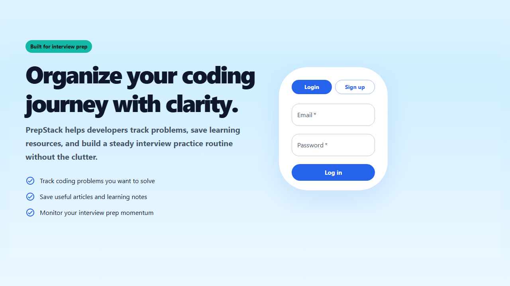
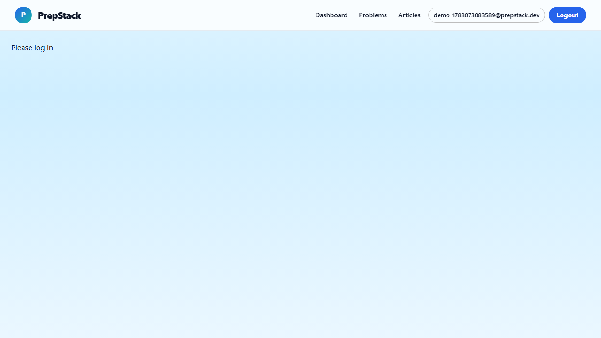
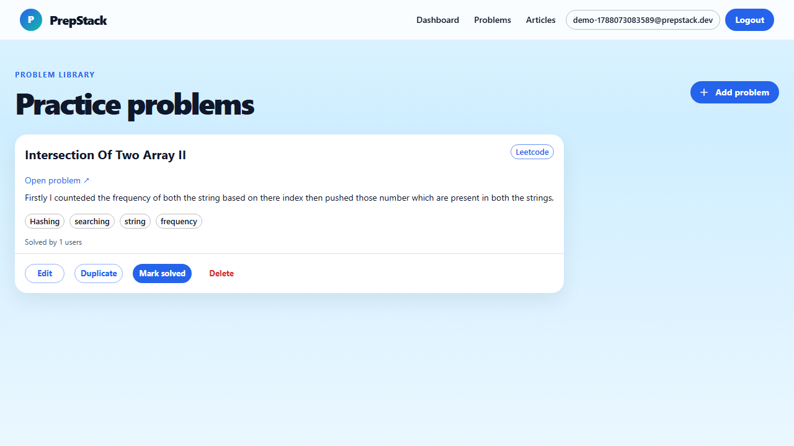
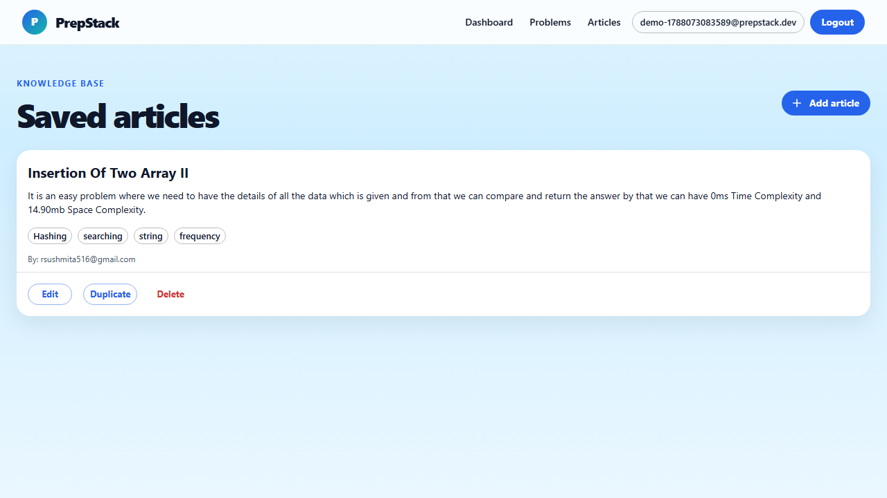

# PrepStack

<div align="center">

[](https://react.dev/)
[](https://nodejs.org/)
[](https://www.mongodb.com/)
[](https://firebase.google.com/)

</div>

A modern interview preparation platform built to help developers organize coding practice, track progress, and save valuable learning resources in one place.

<p align="center">
  
</p>

## Overview

PrepStack is a full-stack productivity app for technical interview preparation. It helps users:

- track coding problems they want to solve
- save useful articles and learning notes
- monitor their progress across topics and skill areas
- build a consistent interview prep routine with less clutter

The project combines a React frontend, an Express backend, MongoDB data storage, and Firebase authentication to deliver a clean, portfolio-ready experience.

## Features

- Secure authentication with Firebase
- Dashboard with progress tracking and skill insights
- Problem tracking and categorization
- Article/resource collection for learning materials
- Modern, responsive user interface
- Protected routes for authenticated users
- Full-stack architecture with reusable API services

## Screenshots

### Authentication screen

<p align="center">
  
</p>

### Dashboard

<p align="center">
  
</p>

### Problems page

<p align="center">
  
</p>

### Articles page

<p align="center">
  
</p>

## Tech Stack

### Frontend
- React
- React Router
- Material UI
- Axios
- Firebase Client SDK

### Backend
- Node.js
- Express
- MongoDB + Mongoose
- Firebase Admin SDK

### Tools
- Concurrently
- Nodemon
- dotenv

## Project Structure

```bash
prepstack/
├── frontend/
│   ├── public/
│   ├── src/
│   ├── package.json
│   └── README.md
├── server/
│   ├── config/
│   ├── controllers/
│   ├── middleware/
│   ├── models/
│   ├── routes/
│   ├── server.js
│   └── package.json
├── package.json
├── README.md
└── docs/
    └── screenshots/
```

## Getting Started

### Prerequisites

- Node.js 18+
- npm
- MongoDB instance or MongoDB Atlas connection
- Firebase project configured for authentication

### 1. Clone the repository

```bash
git clone https://github.com/your-username/prepstack.git
cd prepstack
```

### 2. Install dependencies

```bash
npm install
cd frontend && npm install
cd ../server && npm install
```

### 3. Configure environment variables

Create a `.env` file in the `server` folder and add your MongoDB and backend configuration:

```env
PORT=5000
MONGO_URI=your_mongodb_connection_string
```

Also configure Firebase in the frontend and backend as needed for your project.

### 4. Run the app

From the root directory:

```bash
npm run dev
```

This starts both the backend server and the frontend application together.

## Usage

1. Open the app in your browser at `http://localhost:3000`
2. Sign up or log in
3. Add coding problems you want to solve
4. Save useful articles and preparation notes
5. Track your interview prep progress from the dashboard

## Why PrepStack?

Interview preparation is often scattered across tabs, notes, and bookmarks. PrepStack brings those workflows into a single place so developers can stay focused, organized, and consistent in their preparation journey.

## Architecture

```text
Frontend (React + MUI)      Backend (Express)      Database (MongoDB)
        │                          │                     │
        ├─ Auth and route guarding ─────→ Firebase Auth
        ├─ Dashboard and problem tracking ─→ REST API
        ├─ Articles and notes storage  ─────→ MongoDB Models
        └─ Protected pages and UI state ─────→ JWT validation
```

## Roadmap Ideas

- add streak tracking and daily study goals
- add advanced filtering for problems by topic and difficulty
- add notes and tagging improvements for each problem
- add analytics and performance summaries over time

## License

This project is licensed under the ISC License.

## Author

Built as a personal project focused on clean product design, full-stack engineering, and interview preparation workflows.

<p align="center">
  <a href="https://github.com/your-username/prepstack">
    
  </a>
</p>
